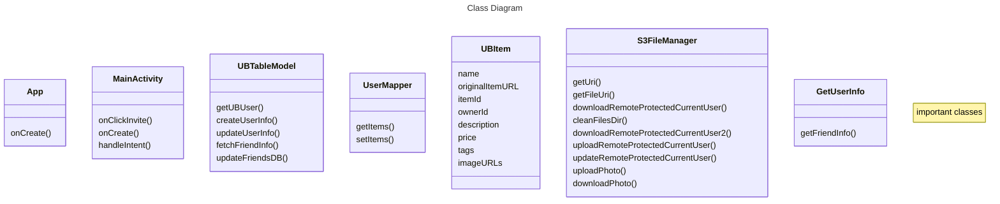

## Android Class Diagram

```mermaid
---
title: Class Diagram
---
classDiagram
    note "important classes"
    
    class App {
        onCreate()
    }
    
    class MainActivity {
        onClickInvite()
        onCreate()
        handleIntent()
    }

    class UBTableModel {
        getUBUser()
        createUserInfo()
        updateUserInfo()
        fetchFriendInfo()
        updateFriendsDB()
    }

    class UserMapper {
        getItems()
        setItems()
    }

    class UBItem {
        name
        originalItemURL
        itemId
        ownerId
        description
        price
        tags
        imageURLs
    }

    class S3FileManager {
        getUri()
        getFileUri()
        downloadRemoteProtectedCurrentUser()
        cleanFilesDir()
        downloadRemoteProtectedCurrentUser2()
        uploadRemoteProtectedCurrentUser()
        updateRemoteProtectedCurrentUser()
        uploadPhoto()
        downloadPhoto()
    }

    class GetUserInfo {
        getFriendInfo()
    }
```