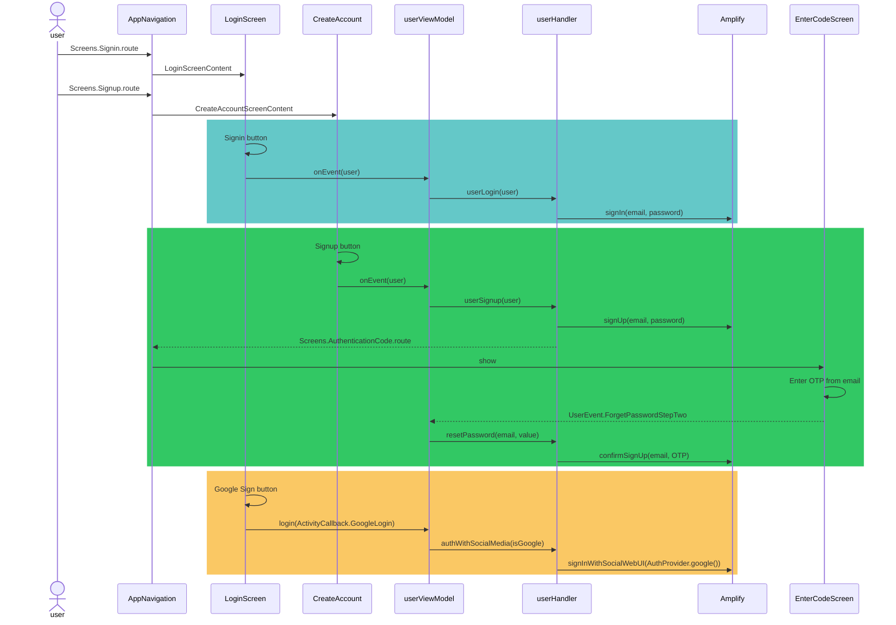

## Android Account SignUp or SignIn flows

```mermaid

sequenceDiagram
    actor user
    
    user->>AppNavigation: Screens.Signin.route
    AppNavigation->>LoginScreen: LoginScreenContent

    user->>AppNavigation: Screens.Signup.route
    AppNavigation->>CreateAccount: CreateAccountScreenContent
    
    rect rgb(100, 200, 200)
    LoginScreen->>LoginScreen: Signin button
    LoginScreen->>userViewModel: onEvent(user)
    userViewModel->>userHandler: userLogin(user)
    userHandler->>Amplify: signIn(email, password)
    end

    rect rgb(50, 200, 100)
    CreateAccount->>CreateAccount: Signup button
    CreateAccount->>userViewModel: onEvent(user)
    userViewModel->>userHandler: userSignup(user)
    userHandler->>Amplify: signUp(email, password)
    userHandler-->>AppNavigation: Screens.AuthenticationCode.route
    AppNavigation->>EnterCodeScreen: show
    EnterCodeScreen->>EnterCodeScreen: Enter OTP from email
    EnterCodeScreen-->>userViewModel: UserEvent.ForgetPasswordStepTwo
    userViewModel->>userHandler: resetPassword(email, value)
    userHandler->>Amplify: confirmSignUp(email, OTP)
    end

    
    rect rgb(250, 200, 100)
    LoginScreen->>LoginScreen: Google Sign button
    LoginScreen->>userViewModel: login(ActivityCallback.GoogleLogin)
    userViewModel->>userHandler: authWithSocialMedia(isGoogle)
    userHandler->>Amplify: signInWithSocialWebUI(AuthProvider.google())
    end
    
```

