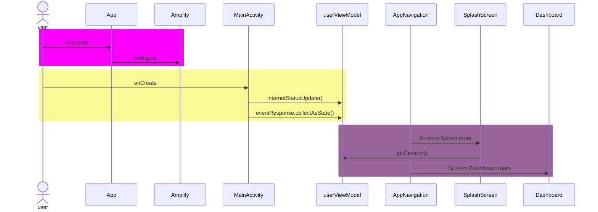
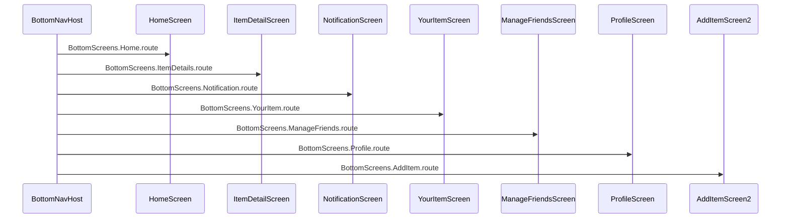
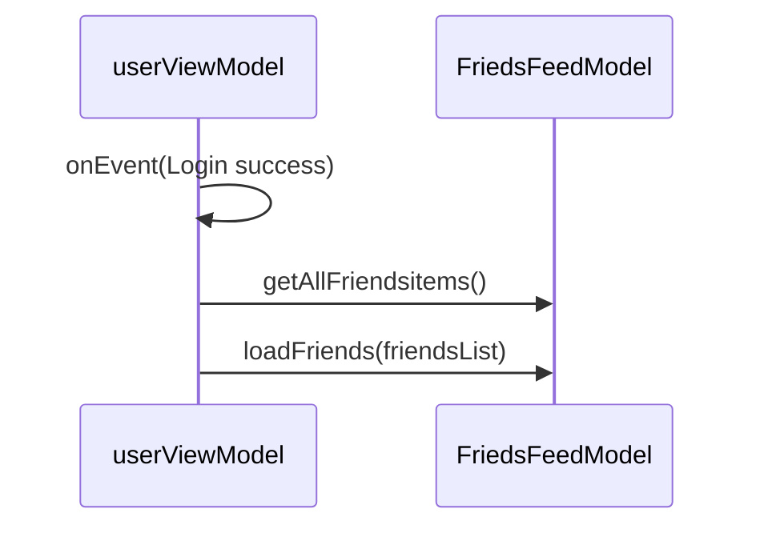

## Android App Launch

```mermaid

sequenceDiagram
    actor user
    
    rect rgb(250, 0, 250)
    user->>App: onCreate
    App->>Amplify: configure
    end

    rect rgb(250, 250, 150)
    user->>MainActivity: onCreate
    MainActivity->>userViewModel: internetStatusUpdate()
    MainActivity->>userViewModel: eventResponse.collectAsState()
    end

    rect rgb(150, 100, 150)
    AppNavigation->>SplashScreen: Screens.Splash.route
    SplashScreen->>userViewModel: getSession()
    AppNavigation->>Dashboard: Screens.Dashboard.route

    end

    
```
## Bottom Navigation routes

```mermaid

sequenceDiagram
    BottomNavHost->>HomeScreen: BottomScreens.Home.route
    BottomNavHost->>ItemDetailScreen: BottomScreens.ItemDetails.route
    BottomNavHost->>NotificationScreen: BottomScreens.Notification.route
    BottomNavHost->>YourItemScreen: BottomScreens.YourItem.route
    BottomNavHost->>ManageFriendsScreen: BottomScreens.ManageFriends.route
    BottomNavHost->>ProfileScreen: BottomScreens.Profile.route
    BottomNavHost->>AddItemScreen2: BottomScreens.AddItem.route
```

## Friends Item Loading

```mermaid
sequenceDiagram
    userViewModel->>userViewModel: onEvent(Login success)
    userViewModel->>FriedsFeedModel: getAllFriendsitems()
    userViewModel->>FriedsFeedModel: loadFriends(friendsList)
```