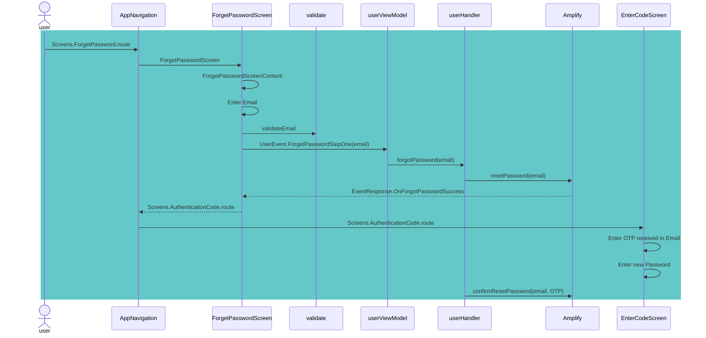

## Android Account Forgot Password flow

```mermaid

sequenceDiagram
    actor user
    
    rect rgb(100, 200, 200)
    user->>AppNavigation: Screens.ForgetPassword.route
    AppNavigation->>ForgetPasswordScreen: ForgetPasswordScreen

    
    ForgetPasswordScreen->>ForgetPasswordScreen: ForgetPasswordScreenContent
    ForgetPasswordScreen->>ForgetPasswordScreen: Enter Email
    ForgetPasswordScreen->>validate: validateEmail
    ForgetPasswordScreen->>userViewModel: UserEvent.ForgetPasswordStepOne(email)
    userViewModel->>userHandler: forgotPassword(email)
    userHandler->>Amplify: resetPassword(email)
    Amplify-->>ForgetPasswordScreen: EventResponse.OnForgotPasswordSuccess
    ForgetPasswordScreen-->>AppNavigation: Screens.AuthenticationCode.route
    AppNavigation->>EnterCodeScreen: Screens.AuthenticationCode.route
    EnterCodeScreen->>EnterCodeScreen: Enter OTP received in Email
    EnterCodeScreen->>EnterCodeScreen: Enter new Password
    userHandler->>Amplify: confirmResetPassword(email, OTP)
    end

    
    
```

