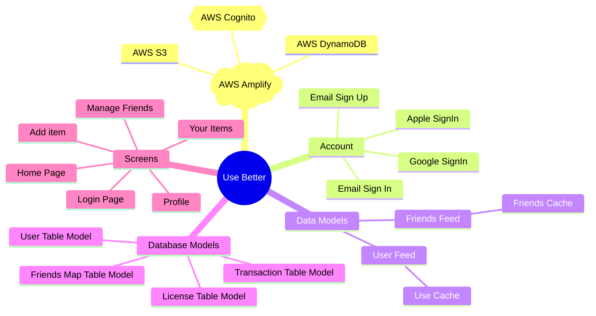
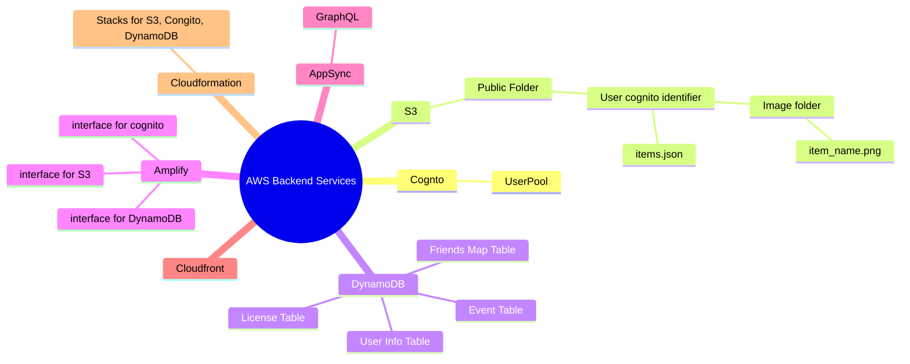
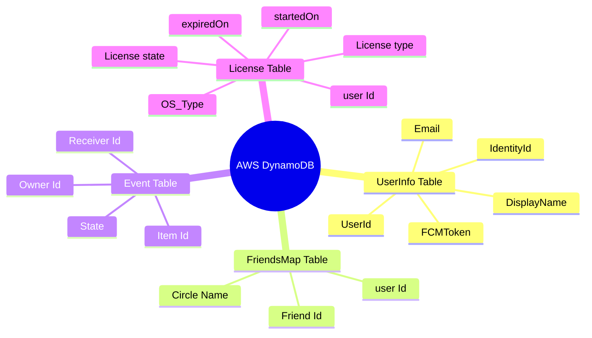
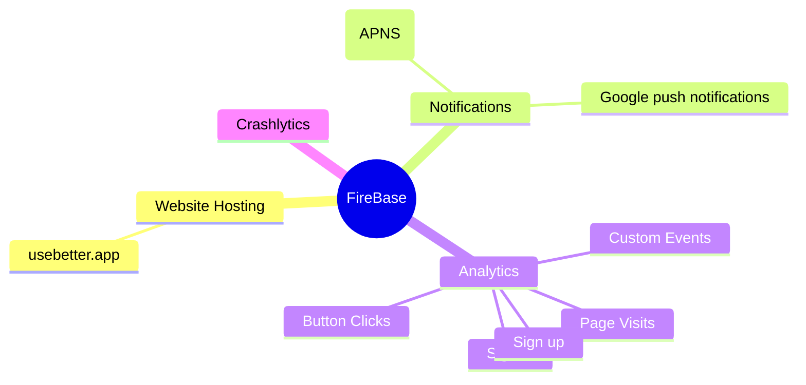

layout: page
title: "Use Better Architecture"
permalink: /about

# **Use Better Architecture**

## Mobile App component Diagram

## AWS Backend Component Diagram

## DynamoDB Table map

## Firebase Backend Component Diagram

