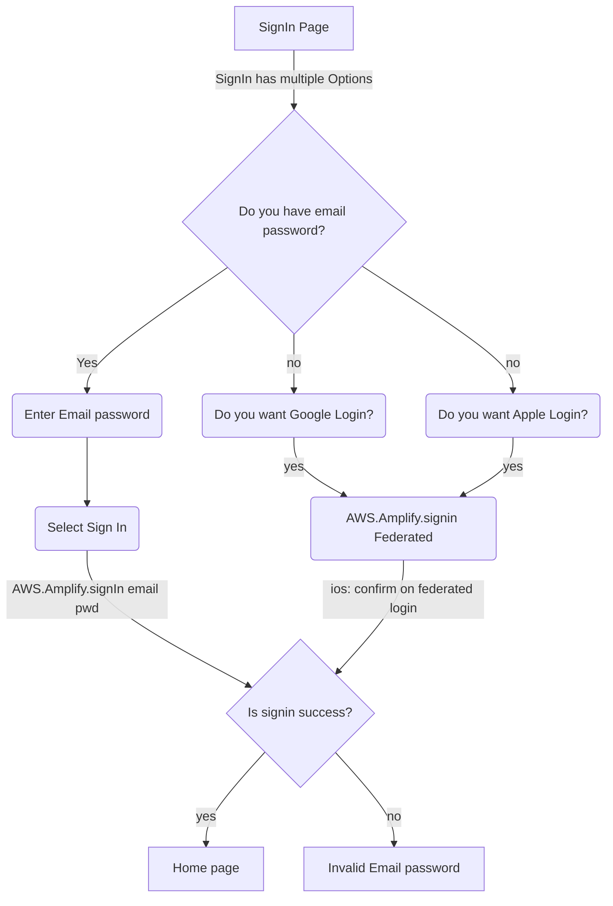

## Signin Flow

```mermaid
flowchart TD
page_signin[SignIn Page] --> |SignIn has multiple Options| decide_signin{Do you have email password?}

decide_signin --> |Yes| email_signin(Enter Email password)
email_signin --> btn_signin(Select Sign In)
btn_signin --> |AWS.Amplify.signIn email pwd| decide_signin_success{Is signin success?}
decide_signin_success --> |yes| Home[Home page]
decide_signin_success --> |no| page_error[Invalid Email password]
decide_signin --> |no| btn_google_signin(Do you want Google Login?)
decide_signin --> |no| btn_apple_signin(Do you want Apple Login?)
btn_google_signin --> |yes| page_federated_sigin(AWS.Amplify.signin Federated)
btn_apple_signin --> |yes| page_federated_sigin
page_federated_sigin --> |ios: confirm on federated login| decide_signin_success    
```