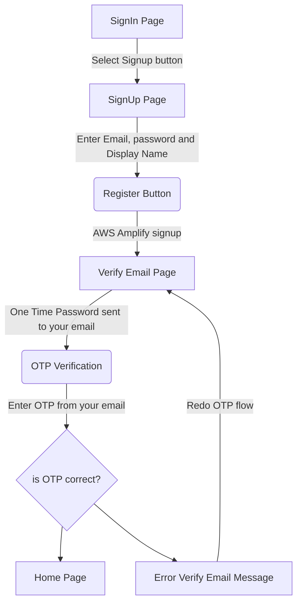

## Signup Flow

```mermaid
flowchart TD
page_signin[SignIn Page] --> |Select Signup button| page_signup
    page_signup[SignUp Page] -->|Enter Email, password and Display Name| btn_signup(Register Button)
    btn_signup -->|AWS Amplify signup| page_otp[Verify Email Page]
    page_otp -->  |One Time Password sent to your email | btn_otp_verify(OTP Verification )
    btn_otp_verify --> |Enter OTP from your email| decide_otp{is OTP correct?}
    decide_otp --> page_home[Home Page]
    decide_otp --> page_error[Error Verify Email Message]
    page_error --> |Redo OTP flow| page_otp

```